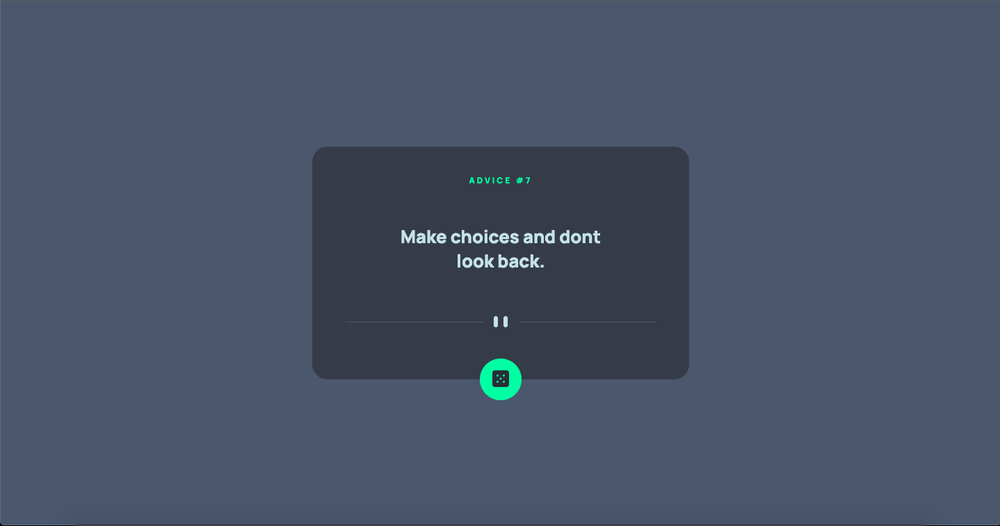

# Frontend Mentor - Advice generator app solution

This is a solution to the [Advice generator app challenge on Frontend Mentor](https://www.frontendmentor.io/challenges/advice-generator-app-QdUG-13db). Frontend Mentor challenges help you improve your coding skills by building realistic projects.

## Table of contents

- [Overview](#overview)
  - [The challenge](#the-challenge)
  - [Screenshot](#screenshot)
  - [Links](#links)
- [My process](#my-process)
  - [Built with](#built-with)
  - [What I learned](#what-i-learned)
- [Author](#author)


**Note: Delete this note and update the table of contents based on what sections you keep.**

## Overview

### The challenge

Users should be able to:

- View the optimal layout for the app depending on their device's screen size
- See hover states for all interactive elements on the page
- Generate a new piece of advice by clicking the dice icon

### Screenshot




### Links


- Live Site URL: [Add live site URL here](https://advice-generator-q6a5kxsza-johnwav.vercel.app)

## My process

### Built with

- Semantic HTML5 markup
- CSS custom properties
- Flexbox
- CSS Grid
- Mobile-first workflow
- [React](https://reactjs.org/) - JS library
- [Styled Components](https://styled-components.com/) - For styles

**Note: These are just examples. Delete this note and replace the list above with your own choices**

### What I learned

How to use Fetch with the useEffect hook


```js
const [data, setData] = useState();
  const [loaded, setLoaded] = useState(false);

  async function getData() {
    await fetch("https://api.adviceslip.com/advice")
      .then((response) => {
        if (response.ok) {
          return response.json();
        }
        throw response;
      })
      .then((data) => {
        setData(data);
      })
      .catch((error) => {
        console.error("Error Fetching Data", error);
      })
      .finally(() => {
        setLoaded(true);
      });
  }

  useEffect(() => {
    getData();
  }, []);
}
```


## Author

- Frontend Mentor - [@johnwav](https://www.frontendmentor.io/profile/johnwav)
- Twitter - [@badmanjwav](https://www.twitter.com/badmanjwav)


